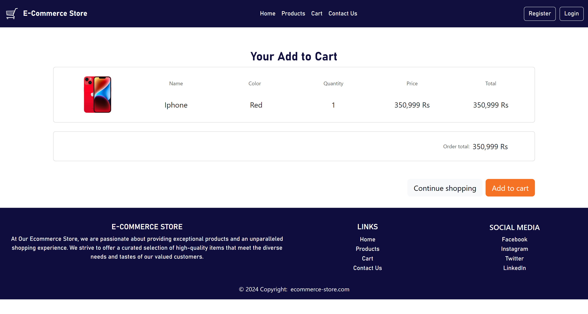
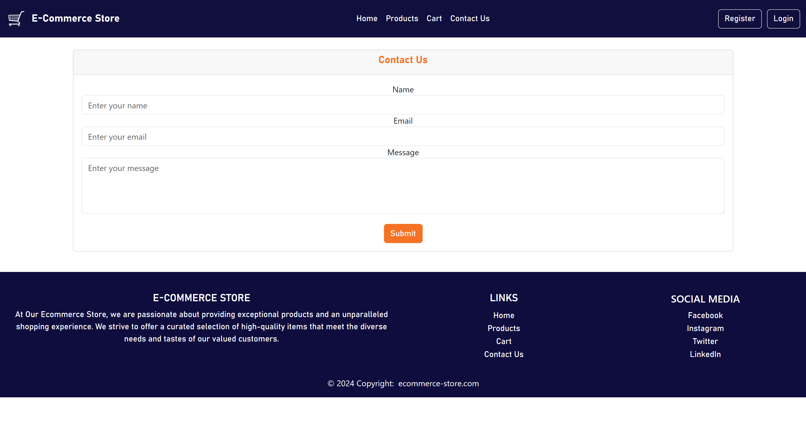
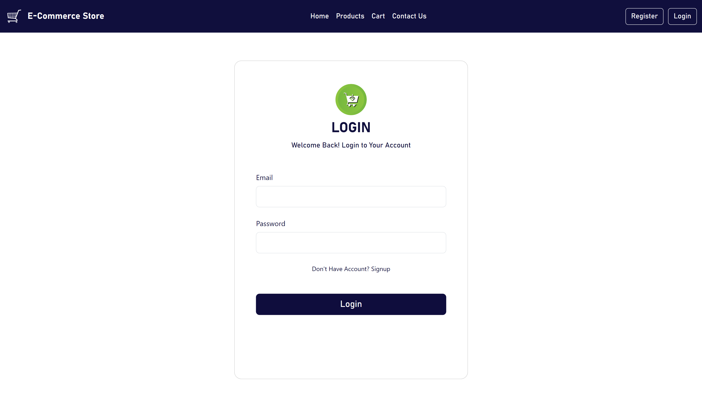
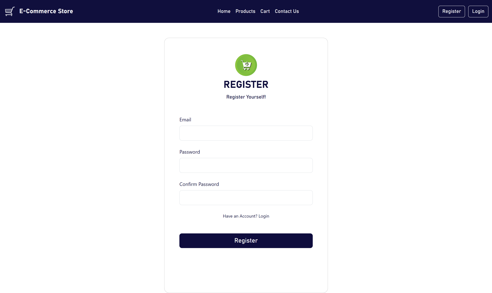

# eCommerce React App

## Overview

Welcome to the eCommerce React App! 🛍️ This is a modern eCommerce site built using React. The project demonstrates the use of React hooks, component organization, and API integration with [FakeStoreAPI](https://fakestoreapi.com).

## Features

- **Home Page**: Displays a selection of featured products.
- **Product Page**: Shows detailed information about a specific product.
- **Cart Page**: Allows users to view and manage their shopping cart.
- **Contact Us Page**: Provides a form for users to get in touch.
- **Login Page**: Enables users to log into their accounts.
- **Signup Page**: Allows new users to create an account.

## Screenshots

### Home Page


### Product Page


### Cart Page



### Contact Us Page



### Login Page



### Signup Page



## Getting Started

To get a local copy up and running, follow these steps:

### Prerequisites

- Node.js
- npm (Node Package Manager)

### Installation

1. Clone the repo:
   ```bash
   git clone https://github.com/Abdur-Rehman-643/ecommerce-react-app.git
   ```
